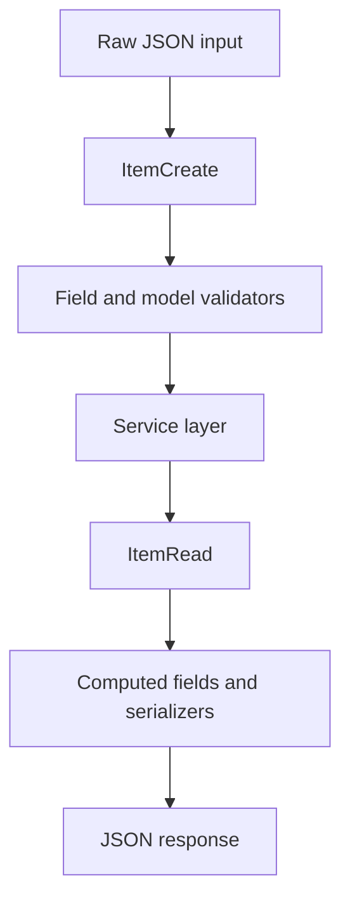

# Pydantic Schemas

This example focuses on Pydantic v2 as the API contract layer: request schemas, response schemas, reusable annotated types, validators, serializers, nested models, and error response models.

## Implementation Plan

1. Define separate create, update, read, list, filter, and error schemas.
2. Add validators and serializers where the API contract needs stronger rules.
3. Demonstrate schema parsing, serialization, and validation failures with self-tests.

## Run

```bash
python3 pydantic_example.py
```

## Diagram



## Standards Demonstrated

- Separate create, update, read, filter, and error schemas.
- `Annotated` aliases for repeated constraints.
- `model_dump(exclude_unset=True)` for PATCH semantics.
- `ConfigDict(from_attributes=True)` for ORM-compatible reads.
- Nested schemas with cross-field validation.
