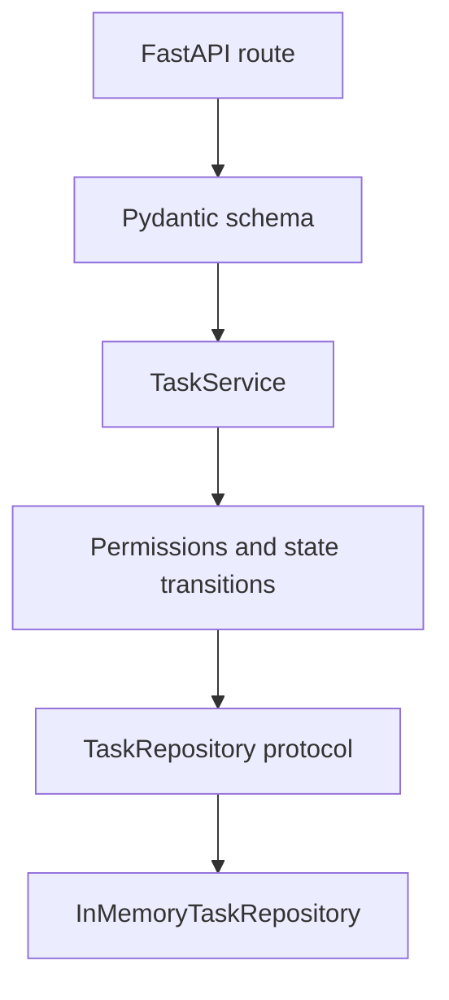

# Service Methods / Business Logic

This example shows a framework-independent service layer. Routes call service methods, services enforce business rules, and repositories handle persistence.

## Implementation Plan

1. Model domain states and domain exceptions outside FastAPI.
2. Put permissions, state transitions, and orchestration in `TaskService`.
3. Test business rules directly against an in-memory repository.

## Run

```bash
python3 service_example.py
python3 -m uvicorn service_example:app --reload --no-server-header
```

## Diagram



## Standards Demonstrated

- Services raise domain exceptions, not `HTTPException`.
- Business actions have explicit methods such as `start_task` and `archive_task`.
- Permission and state checks live in the service layer.
- Repository access goes through a `Protocol`.
- Self-tests exercise business rules without a web server.
