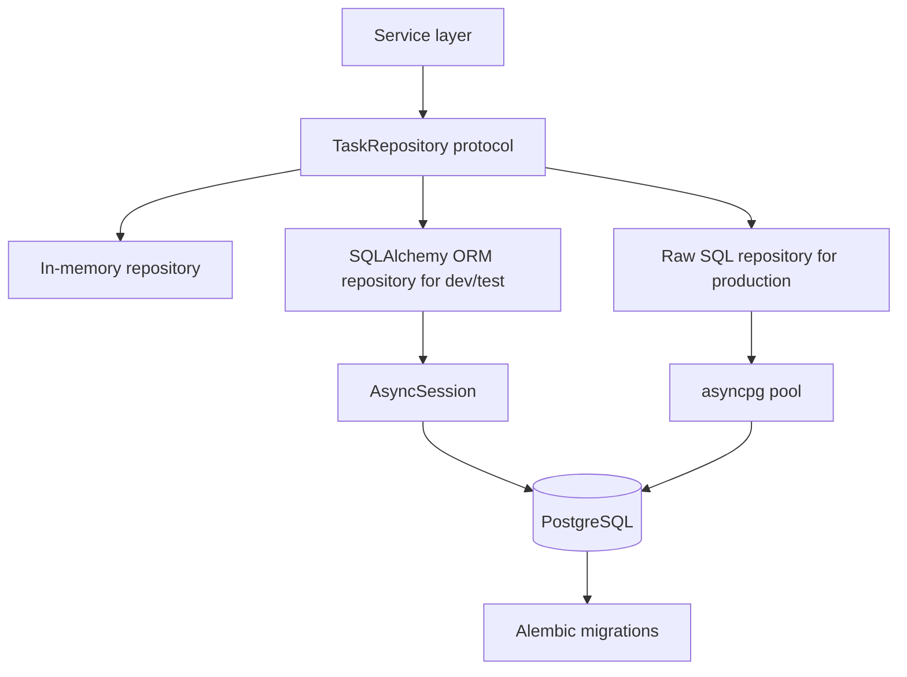

# Database Models + Repository Methods

This example documents the database boundary: ORM-backed development/testing, raw SQL production repositories, repository protocols, sessions/pools, and migration notes.

## Implementation Plan

1. Keep ORM models, Pydantic schemas, and service records separate.
2. Use ORM repositories for local development, fixtures, and integration tests.
3. Use raw SQL repositories in production deployments when query control and lower overhead matter.
4. Keep both implementations behind the same `TaskRepository` protocol.

## Run

```bash
python3 database_example.py
python3 -m uvicorn database_example:app --reload --no-server-header
```

## Diagram



## Standards Demonstrated

- ORM models stay separate from Pydantic schemas.
- ORM is the preferred local development and testing path.
- Raw SQL is the preferred production path when performance and explicit query control matter.
- Repository methods return plain records or read models.
- `exclude_unset=True` protects PATCH updates.
- Async ORM sessions and raw SQL pools are request-scoped through the DI layer.
- Alembic migrations can still use ORM metadata even when deployed code uses raw SQL.

## Persistence Strategy

Use the repository protocol as the stable boundary:

| Environment | Repository | Why |
|-------------|------------|-----|
| Unit tests | `InMemoryTaskRepository` | Fast, deterministic, no database required |
| Local development | `SqlAlchemyTaskRepository` | Faster iteration, readable fixtures, model-driven migrations |
| Integration tests | `SqlAlchemyTaskRepository` or test DB raw SQL | Matches schema behavior while keeping setup manageable |
| Production | `RawSqlTaskRepository` | Avoids ORM hydration/unit-of-work overhead and keeps hot-path SQL explicit |

The service layer should not know which repository is active. Swap the implementation in dependency injection only.
