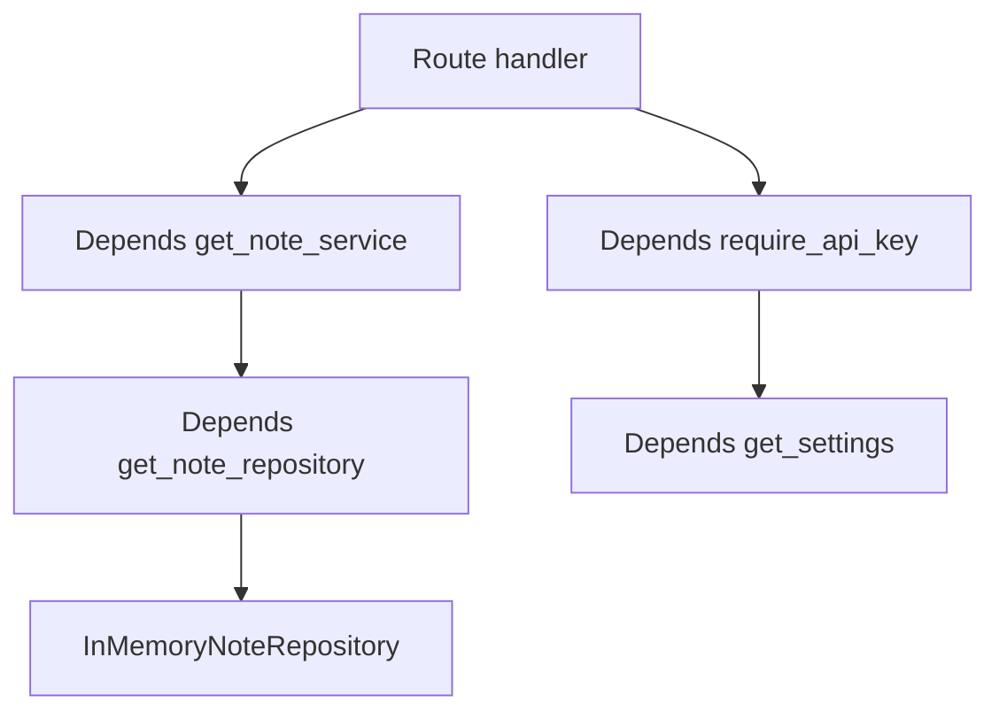

# Dependency Injection

This example shows FastAPI dependency injection for settings, repositories, services, and authentication.

## Implementation Plan

1. Make settings, repositories, auth, and services separate dependency functions.
2. Use typed aliases to keep route signatures readable.
3. Prove dependencies are swappable with self-tests.

## Run

```bash
python3 dependency_injection_example.py
python3 -m uvicorn dependency_injection_example:app --reload --no-server-header
```

## Diagram



## Standards Demonstrated

- Dependencies are small and composable.
- Route signatures use typed aliases for readability.
- Settings and services can be overridden in tests.
- Authentication is modeled as a dependency, not inline route code.
