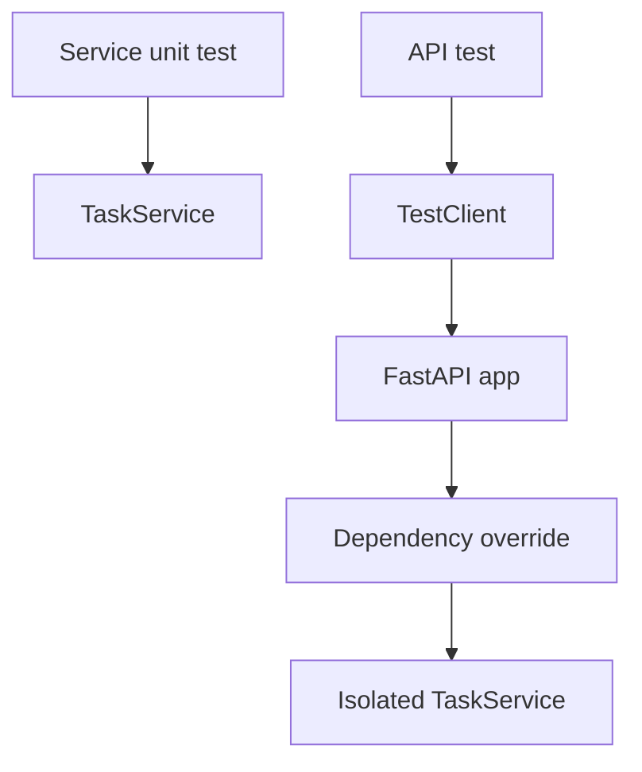

# Tests

This example shows focused service and API tests using `TestClient`, dependency overrides, validation assertions, and not-found assertions.

## Implementation Plan

1. Test service behavior without HTTP.
2. Test API behavior through FastAPI `TestClient`.
3. Use dependency overrides to isolate state between test cases.

## Run

```bash
python3 tests_example.py
```

## Diagram



## Standards Demonstrated

- Service tests run without HTTP.
- API tests use real FastAPI request handling.
- Dependency overrides isolate state between tests.
- Validation and not-found cases are covered.
