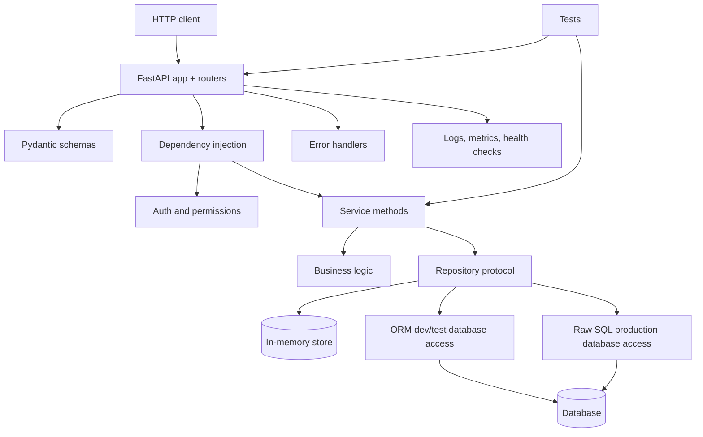

# Python REST API Learning Examples

This repository is a step-by-step reference for building production-style Python REST APIs. Each checklist item has its own folder with a runnable example, a README, and a Mermaid diagram.

## Quick Start

```bash
python3 main.py
```

The launcher can run script demos, start FastAPI servers, and run smoke tests for server-backed examples.

## Checklist Map

| Step | Folder | Focus |
|------|--------|-------|
| 1 | `01-fastapi-app-routers` | FastAPI app setup, routers, middleware, health checks |
| 2 | `02-pydantic-schemas` | Pydantic v2 request/response/filter/error schemas |
| 3 | `03-service-methods` | Service methods, domain rules, repository protocols |
| 4 | `04-database-models-repositories` | ORM for dev/test, raw SQL for production, repositories, sessions/pools, Alembic notes |
| 5 | `05-dependency-injection` | Settings, repositories, services, auth dependencies |
| 6 | `06-error-handling` | Consistent error envelopes and exception handlers |
| 7 | `07-auth-permissions` | Bearer auth, principals, resource permissions |
| 8 | `08-tests` | Service tests, API tests, dependency overrides |
| 9 | `09-observability-deployment` | JSON logs, request IDs, metrics, health/readiness, deployment snippets |

## Overall Architecture



## Run Examples Directly

```bash
python3 02-pydantic-schemas/pydantic_example.py
python3 03-service-methods/service_example.py
python3 04-database-models-repositories/database_example.py
python3 05-dependency-injection/dependency_injection_example.py
python3 06-error-handling/error_handling_example.py
python3 07-auth-permissions/auth_permissions_example.py
python3 08-tests/tests_example.py
python3 09-observability-deployment/observability_deployment_example.py
```

For FastAPI examples, run from the example folder:

```bash
cd 01-fastapi-app-routers
python3 -m uvicorn fastapi_example:app --reload --no-server-header
```

## Code Standards Used

- Keep route handlers thin: parse input, call a service, return a response.
- Keep business rules in service methods, not routers or repositories.
- Keep persistence behind repository methods or protocols.
- Use ORM repositories for development/testing ergonomics, then swap to raw SQL repositories for production hot paths.
- Use separate Pydantic schemas for create, update, read, list, filters, and errors.
- Use dependency injection for settings, auth, repositories, services, and database sessions.
- Return consistent error envelopes from exception handlers.
- Test service logic without HTTP and API behavior with FastAPI `TestClient`.
- Include operational basics: health checks, readiness checks, structured logs, metrics, and deployment notes.

## Dependencies

The examples use:

```bash
python3 -m pip install fastapi uvicorn pydantic
```

Some database notes mention SQLAlchemy for development/test ORM workflows, asyncpg for production raw SQL repositories, Alembic for migrations, and pydantic-settings for configuration. The runnable examples use in-memory stores so they do not require a database.
