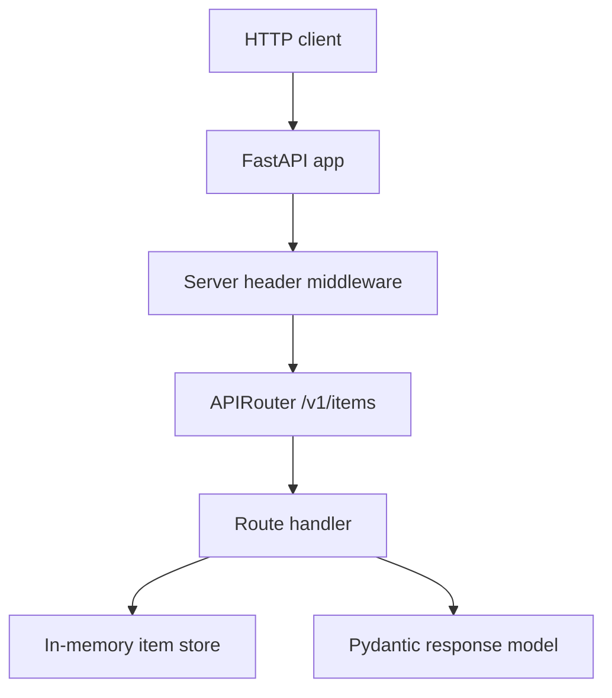

# FastAPI App + Routers

This example shows the HTTP surface of a REST API: app creation, lifespan, middleware, routers, path/query parameters, health checks, and structured error envelopes.

## When To Use It

Use this pattern when you want a clean starting point for a resource-oriented FastAPI service with clear route grouping and operational endpoints.

## Implementation Plan

1. Create the `FastAPI` app with lifespan and middleware.
2. Group resource endpoints under `APIRouter`.
3. Add health/readiness routes and smoke-test the HTTP surface.

## Run

```bash
python3 -m uvicorn fastapi_example:app --reload --no-server-header
```

Open `http://127.0.0.1:8000/docs`.

## Diagram



## Standards Demonstrated

- One `FastAPI` app with a lifespan context manager.
- Resource routes grouped under `APIRouter`.
- Explicit status codes such as `201` and `204`.
- Health and readiness endpoints for deployment platforms.
- Structured errors instead of raw `{"detail": ...}` responses.

## Demo vs Production

- The demo uses an in-memory store to keep the HTTP layer easy to inspect.
- In production, pair this with the service, repository, auth, and observability topics.

## Best Paired With

- [`../02-pydantic-schemas/README.md`](../02-pydantic-schemas/README.md)
- [`../03-service-methods/README.md`](../03-service-methods/README.md)
- [`../06-error-handling/README.md`](../06-error-handling/README.md)
