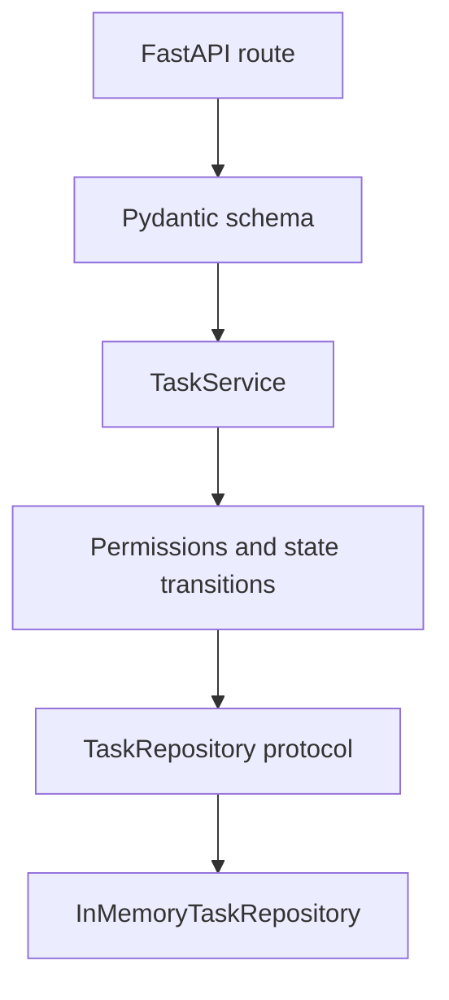

# Service Methods / Business Logic

This example shows a framework-independent service layer. Routes call service methods, services enforce business rules, and repositories handle persistence.

## When To Use It

Use this pattern when business rules are becoming too important to live in route handlers or too complex to bury inside repository code.

## Implementation Plan

1. Model domain states and domain exceptions outside FastAPI.
2. Put permissions, state transitions, and orchestration in `TaskService`.
3. Test business rules directly against an in-memory repository.

## Run

```bash
python3 service_example.py
python3 -m uvicorn service_example:app --reload --no-server-header
```

## Diagram



## Standards Demonstrated

- Services raise domain exceptions, not `HTTPException`.
- Business actions have explicit methods such as `start_task` and `archive_task`.
- Permission and state checks live in the service layer.
- Repository access goes through a `Protocol`.
- Self-tests exercise business rules without a web server.

## Demo vs Production

- The demo keeps persistence in memory so the business rules are front and center.
- In production, the same service contract should sit above a real repository implementation.

## Best Paired With

- [`../04-database-models-repositories/README.md`](../04-database-models-repositories/README.md)
- [`../06-error-handling/README.md`](../06-error-handling/README.md)
- [`../08-tests/README.md`](../08-tests/README.md)
