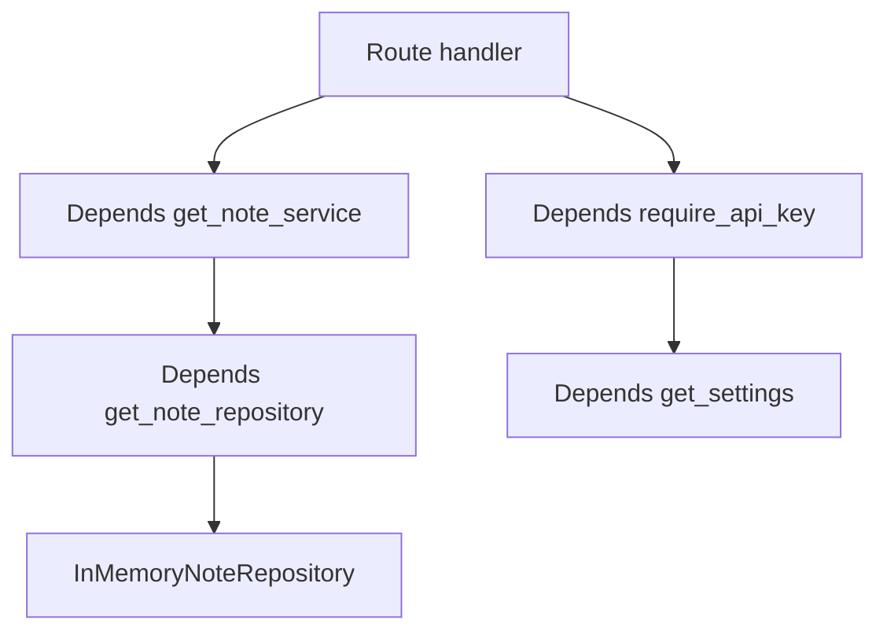

# Dependency Injection

This example shows FastAPI dependency injection for settings, repositories, services, and authentication.

## When To Use It

Use this pattern when you want to swap settings, repositories, or auth behavior without rewriting route handlers.

## Implementation Plan

1. Make settings, repositories, auth, and services separate dependency functions.
2. Use typed aliases to keep route signatures readable.
3. Prove dependencies are swappable with self-tests.

## Run

```bash
python3 dependency_injection_example.py
python3 -m uvicorn dependency_injection_example:app --reload --no-server-header
```

## Diagram



## Standards Demonstrated

- Dependencies are small and composable.
- Route signatures use typed aliases for readability.
- Settings and services can be overridden in tests.
- Authentication is modeled as a dependency, not inline route code.

## Demo vs Production

- The demo uses a simple API key check to keep the dependency graph easy to follow.
- In production, the same structure can back JWT auth, database sessions, and external clients.

## Best Paired With

- [`../04-database-models-repositories/README.md`](../04-database-models-repositories/README.md)
- [`../07-auth-permissions/README.md`](../07-auth-permissions/README.md)
- [`../08-tests/README.md`](../08-tests/README.md)
