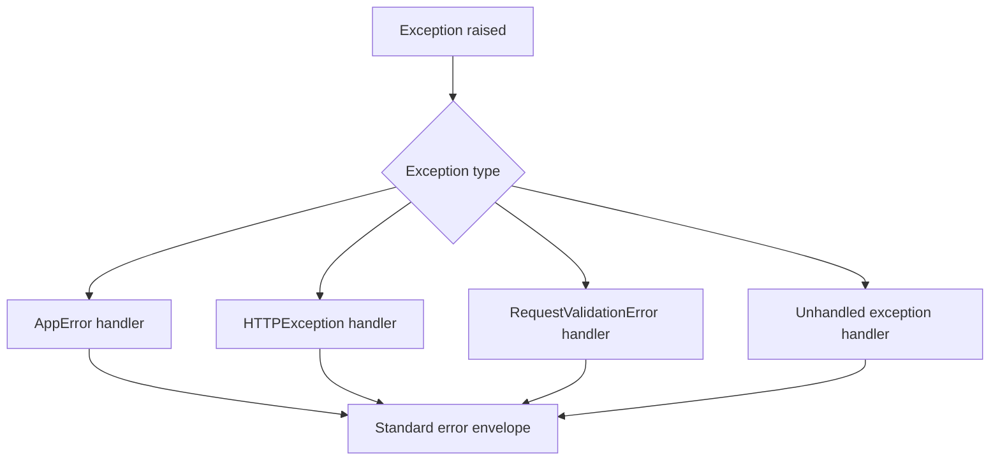

# Error Handling

This example shows consistent HTTP error envelopes for domain errors, route misses, validation errors, and unhandled exceptions.

## When To Use It

Use this pattern when clients need a stable, machine-readable error shape instead of ad hoc exception messages.

## Implementation Plan

1. Define one error envelope shape for clients.
2. Register handlers for domain, HTTP, validation, and unknown errors.
3. Test each error path so clients can rely on stable codes.

## Run

```bash
python3 error_handling_example.py
python3 -m uvicorn error_handling_example:app --reload --no-server-header
```

## Diagram



## Standards Demonstrated

- Domain exceptions map to stable machine-readable codes.
- Validation errors include per-field details.
- Routing 404s are distinguishable from missing resources.
- Server logs keep traceback details out of client responses.

## Demo vs Production

- The demo keeps the exception tree small so the envelope behavior is easy to see.
- In production, the same pattern should be shared across the whole API surface.

## Best Paired With

- [`../01-fastapi-app-routers/README.md`](../01-fastapi-app-routers/README.md)
- [`../03-service-methods/README.md`](../03-service-methods/README.md)
- [`../09-observability-deployment/README.md`](../09-observability-deployment/README.md)
