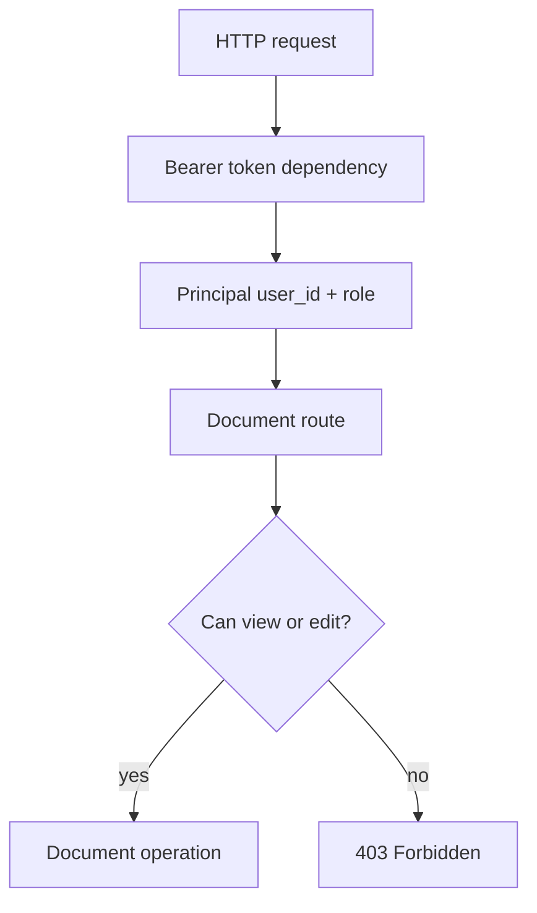

# Auth / Permissions

This example demonstrates bearer-token authentication and resource-level authorization.

## When To Use It

Use this pattern when identity and permission rules need to be explicit, testable, and separate from the business logic itself.

## Implementation Plan

1. Convert bearer tokens into typed principals.
2. Centralize permission checks in small helpers.
3. Cover unauthenticated, authorized, and admin access paths.

## Run

```bash
python3 auth_permissions_example.py
python3 -m uvicorn auth_permissions_example:app --reload --no-server-header
```

## Diagram



## Standards Demonstrated

- Authentication returns a typed principal.
- Authorization checks are explicit helper functions.
- Admins can access all documents; users can access their own.
- Missing or invalid credentials return `401`; denied actions return `403`.

## Demo vs Production

- The demo uses hard-coded bearer tokens so the authorization flow is easy to inspect.
- In production, replace the token source and principal lookup without changing the permission shape.

## Best Paired With

- [`../05-dependency-injection/README.md`](../05-dependency-injection/README.md)
- [`../03-service-methods/README.md`](../03-service-methods/README.md)
- [`../08-tests/README.md`](../08-tests/README.md)
