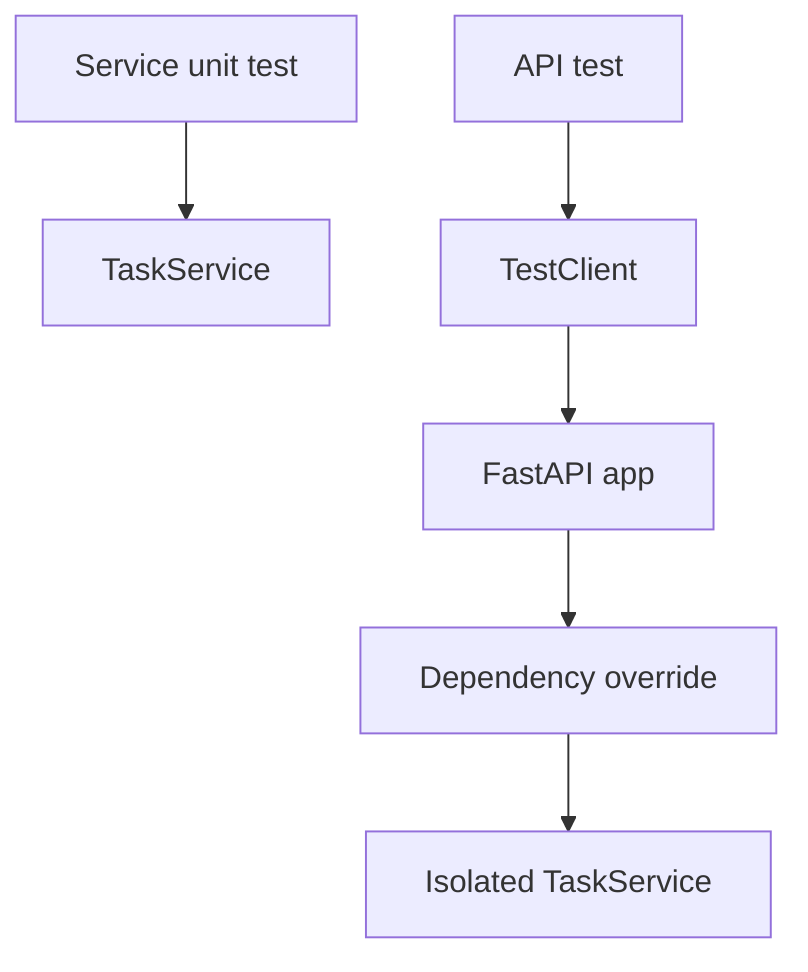

# Tests

This example shows focused service and API tests using `TestClient`, dependency overrides, validation assertions, and not-found assertions.

## When To Use It

Use this pattern when you want fast feedback on service rules and route behavior without building a full external test harness.

## Implementation Plan

1. Test service behavior without HTTP.
2. Test API behavior through FastAPI `TestClient`.
3. Use dependency overrides to isolate state between test cases.

## Run

```bash
python3 tests_example.py
```

## Diagram



## Standards Demonstrated

- Service tests run without HTTP.
- API tests use real FastAPI request handling.
- Dependency overrides isolate state between tests.
- Validation and not-found cases are covered.

## Demo vs Production

- The demo sticks to assert-based tests so it runs with `python3` alone.
- In production, these patterns map cleanly into `pytest`, fixtures, and CI checks.

## Best Paired With

- [`../03-service-methods/README.md`](../03-service-methods/README.md)
- [`../05-dependency-injection/README.md`](../05-dependency-injection/README.md)
- [`../07-auth-permissions/README.md`](../07-auth-permissions/README.md)
